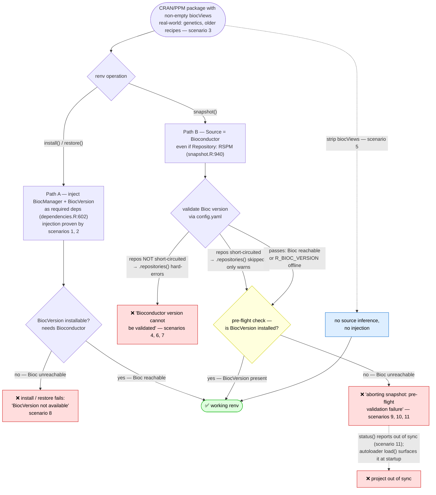

# renv biocViews → BiocVersion dependency repro

This repo demonstrates that renv treats a **non-empty `biocViews` field** in a DESCRIPTION
file as a Bioconductor signal, even on a package installed from CRAN/PPM. This breaks renv
in CRAN/PPM-only enterprise environments where Bioconductor is unreachable — even when the
user has not explicitly depended on any Bioconductor package.

A non-empty `biocViews` field triggers **two distinct renv mechanisms** (see §1), each
breaking a different operation. They are separate code paths with separate entry points, but
they are not isolated at runtime: inside a single `renv::snapshot()` both can fire, and both
ultimately dead-end on the same uninstallable `BiocVersion`.

- **Path A — dependency injection of an uninstallable `BiocVersion`.** A `biocViews` field
  makes renv inject `BiocManager` + `BiocVersion` as implicit dependencies
  (`dependencies.R:602`). Because `BiocVersion` is Bioconductor-only and cannot be obtained
  from CRAN/PPM, this one root cause surfaces in three places: `renv::install()` /
  `renv::restore()` fail outright; `renv::snapshot()` aborts at **pre-flight validation**
  once Path B's network probe is silenced (`BiocVersion [required by metaRNASeq]` not
  installed); and `renv::status()` reports the project **out of sync** ("used in the project
  but never installable"). The same inconsistency is what the renv autoloader (`renv::load()`,
  sourced from `renv/activate.R`) surfaces on **every** session startup — though only the
  `status()` surface is captured as an artifact here (scenario 11).
- **Path B — snapshot source inference → a Bioconductor version probe.** When a project
  merely *depends on* an installed CRAN/PPM package whose DESCRIPTION has `biocViews`, renv
  infers `Source = "Bioconductor"` for it (even with `Repository: RSPM`) and
  `renv::snapshot()` fails resolving the Bioconductor version over the network
  (`config.yaml`). On this path the *first* failure is purely version validation — the
  injected `BiocVersion` is discovered too (it is the same metaRNASeq project), but missing
  `BiocVersion` does not surface until the version probe is silenced (scenarios 9–11).

In a CRAN/PPM-only environment where Bioconductor is *never* reachable, `BiocVersion` is
never installed, so **under this repo's non-interactive measurement (`prompt = FALSE`,
`force = FALSE`)** silencing the Path B probe just moves `snapshot()`'s failure from the
version check to the Path A pre-flight check (scenarios 9–11) — it does not let `snapshot()`
complete. The customer-reported "snapshot succeeds but goes out of sync" state *is* reachable,
but only via the continuation paths in `renv_snapshot_validate_report()` (`snapshot.R:335`):
`force = TRUE`, or an interactive session where the user answers the proceed prompt. The
harness here exercises neither, which is why every scenario below ends in a clean abort.

**Environment used in this run**

- R 4.4.2 (rocker/r-ver:4.4.2), renv 1.2.3 (pinned), Ubuntu 24.04 (Noble)
- CRAN repo: Posit Package Manager (Noble Linux binaries)
- Bioconductor blocking: Docker `--add-host` redirects `bioconductor.org → 127.0.0.1`

---

## Quick start

```bash
./run_matrix.sh
```

Builds a Docker image (once) and runs all 11 scenarios. Artifacts land in `artifacts/`.

```
artifacts/
  summary.json          # machine-readable results for all scenarios
  1/ … 11/              # per-scenario logs and results
```

```bash
./run_matrix.sh 4 5 8    # run specific scenarios
./run_matrix.sh --build-only
./reset.sh               # wipe artifacts for a clean re-run
./reset.sh --rmi         # also remove the Docker image
./fetch_renv_source.sh   # refresh renv-source/ from GitHub (default: 1.2.3)
```

**Prerequisites:** Docker, internet access to `packagemanager.posit.co`.

---

## Scenario matrix

**Core proof** — the controlled demonstration of the thesis. Each path is shown with a
single-variable pair: discovery with/without `biocViews` (1 vs 2), and snapshot with
`biocViews` present vs stripped (4 vs 5). Scenario 8 is the second, install-time path.

| # | Description | Operation | Network | biocViews | Result |
|---|-------------|-----------|---------|-----------|--------|
| **1** | Discovery — fixture without biocViews | `dependencies()` | open | absent | no injection |
| **2** | Discovery — fixture with biocViews | `dependencies()` | open | present | injects BiocManager + **BiocVersion** |
| **4** | **Path B**: depends on `metaRNASeq` (biocViews) | `snapshot()` | Bioc blocked | present | **fails** |
| **5** | **Control**: `metaRNASeq`, biocViews **stripped** | `snapshot()` | Bioc blocked | stripped | **succeeds** |
| **8** | **Path A**: project *is* a package with biocViews | `install()` | Bioc blocked | present | **fails** |

**Supporting / workarounds attempted** — real-world motivation (3) and proof that the
common Bioconductor-side mitigations do *not* resolve it (6, 7), nor do the renv-option /
env-var short-circuits raised in the support chain (9, 10), which only change *how*
`snapshot()` fails. Scenario 11 shows that even the full combo — which *does* silence the
Path B network probe — does not make `snapshot()` succeed: it just moves the failure to
Path A's pre-flight check (`BiocVersion` not installed), the same root cause that
`status()` reports as out of sync (and the autoloader surfaces at startup).

| # | Description | Operation | Network | biocViews | Result |
|---|-------------|-----------|---------|-----------|--------|
| **3** | Real CRAN package `genetics` carries biocViews | inspect | open | present | metadata only |
| **6** | Workaround: `bioconductor.version("3.20")` | `snapshot()` | Bioc blocked | present | **fails** |
| **7** | Workaround: `BioCsoft` → PPM Bioconductor mirror | `snapshot()` | Bioc blocked | present | **fails** |
| **9** | Workaround: `renv.bioconductor.repos = character(0)` (initial attempt) | `snapshot()` | Bioc blocked | present | **fails** |
| **10** | Workaround: `renv.bioconductor.repos` = real fast URL (support #1) | `snapshot()` | Bioc blocked | present | **fails** |
| **11** | Full combo silences the probe (Path A surfaces) | `snapshot()` + `status()` | Bioc blocked | present | **fails** (pre-flight) + **out of sync** |

Scenarios 4–7 and 9–11 use a two-phase Docker approach: the package is installed via
`renv::install()` with an open network (so renv records CRAN/PPM as the source), then the
operation under test runs in a second container with Bioconductor blocked. Scenario 4's
install phase additionally calls renv's own source-inference function on the installed
package to capture the `Source = "Bioconductor"` misclassification directly (see §3).
Scenario 11's snapshot phase runs `renv::status()` after the (failed) snapshot to capture
the out-of-sync state (see §5b).

---

## The gauntlet — every gate from `biocViews` to a working renv

Each diamond is a gate that must pass to reach a working renv; the labels show which scenario
exercises each outcome. In a CRAN/PPM-only environment the only ways through are to strip
`biocViews` (scenario 5) or to make Bioconductor reachable so `BiocVersion` can install — every
short-circuit option simply moves *which* gate fails.



Read it as two columns sharing one root cause: the **install/restore** branch (Path A) and
the **snapshot** branch (Path B). Both originate from the same `biocViews` field, and in a
no-Bioconductor environment both dead-end on the uninstallable `BiocVersion` — the snapshot
branch just has to clear the version probe (scenarios 4/6/7/9/10) before it reaches that same
wall (scenarios 9/10/11).

---

## How success is measured

`renv::snapshot()` and `renv::install()` emit warnings as part of normal operation, so the
harness does **not** wrap them in a `tryCatch(warning=)` (that would let the first warning
abort the call and make a merely-warned run look like a failure — or vice-versa). Instead it
uses `withCallingHandlers` to capture warnings without unwinding, lets the call run to
completion, and then judges the outcome on **what actually lands in the lockfile / library**:

- **failure** — the operation raised an error.
- **incomplete** — no error, but the project's target package was *not* recorded/installed.
  (A distinct outcome the harness can report; none of the scenarios here produce it — each is
  either a clean failure or a clean success.)
- **success** — the target package was recorded (snapshot) or installed (install).

See `scripts/30_snapshot.R` and `scripts/16_install_project_deps.R`.

---

## 1. The two mechanisms

Both paths key off the same one-line `biocViews` test but live in different renv functions.
The fetched source is in `renv-source/R/` (see `renv-source/README.md` for annotated lines).

### Path A — dependency injection (`dependencies.R:602`)

```r
# if this is a bioconductor package, add their implicit dependencies
# https://github.com/rstudio/renv/issues/2149
if (nzchar(dcf[["biocViews"]] %||% "")) {
  data[[length(data) + 1L]] <- renv_dependencies_list(
    source   = path,
    packages = c(renv_bioconductor_manager(), "BiocVersion")
  )
  names(data)[[length(data)]] <- "Bioconductor"
}
```

`renv::dependencies()` over a DESCRIPTION with `biocViews` adds `BiocManager` + `BiocVersion`
as implicit dependencies. This drives **scenarios 1, 2 and 8**.

### Path B — snapshot source inference (`snapshot.R:940`)

```r
# packages from Bioconductor are normally tagged with a 'biocViews' entry;
# use that to infer a Bioconductor source
if (nzchar(dcf[["biocViews"]] %||% ""))
  return(list(Source = "Bioconductor"))
```

When snapshot records an *installed* package, this runs **before** the repository checks, so a
CRAN/PPM package whose DESCRIPTION has `biocViews` is recorded as `Source = "Bioconductor"`
even though its `Repository` is `RSPM`. `renv_snapshot_validate_bioconductor()`
(`snapshot.R:368`) then resolves the Bioconductor version over the network. This drives
**scenarios 4, 6 and 7**. Note the *first* failure on this path is version validation, not the
injected `BiocVersion`: snapshot runs all four validators (`snapshot.R:317`), and the version
probe aborts before missing `BiocVersion` matters. That injected dependency *is* present on
this project — it is what aborts the pre-flight check once the probe is silenced (scenarios
9–11).

### Which proof section covers which path

| Path | Mechanism | Proof sections | Scenarios |
|------|-----------|----------------|-----------|
| **A** | dependency injection of uninstallable `BiocVersion` → `install()`/`restore()` fail; `snapshot()` aborts at pre-flight once the probe is silenced; `status()` (and the startup autoloader) report out of sync | §2 (discovery), §4 (install), §5b (short-circuit combo) | 1, 2, 8, 11 |
| **B** | snapshot source inference → Bioconductor version probe → `snapshot()` fails | §3 (minimal pair), §5 (workarounds) | 4, 5, 6, 7, 9, 10 |

Scenario 3 (`genetics`) belongs to neither failure — it is path-neutral motivation, showing the
`biocViews` trigger exists on ordinary CRAN packages and so feeds *both* paths.

---

## 2. Discovery proof — Path A injection (scenarios 1 & 2)

Two minimal local packages under `fixtures/` differ only in the presence of `biocViews`.
Scenarios 1 and 2 run `renv::dependencies()` directly on each DESCRIPTION.

| Fixture | biocViews field | BiocManager discovered | BiocVersion discovered |
|---------|----------------|------------------------|------------------------|
| `cranlike-no-biocviews` | absent | No | No |
| `cranlike-with-biocviews` | `biocViews: Software` | **Yes** | **Yes** |

Scenario 2's discovered-dependencies CSV shows both packages tagged `Type = "Bioconductor"`:

```
"Type","Source","Package","Require","Version","Dev"
"Imports",".../cranlike-with-biocviews/DESCRIPTION","stats","","",FALSE
"Bioconductor",".../cranlike-with-biocviews/DESCRIPTION","BiocManager","","",FALSE
"Bioconductor",".../cranlike-with-biocviews/DESCRIPTION","BiocVersion","","",FALSE
```

Evidence: `artifacts/1/discovered-dependencies.csv`, `artifacts/2/discovered-dependencies.csv`.

Real CRAN packages carry the same trigger (this is path-neutral motivation — the trigger feeds
both paths): scenario 3 installs `genetics` from PPM and shows it has `biocViews: Genetics`
while `Repository: RSPM` (`artifacts/3/cran-pkg_DESCRIPTION.txt`). It is not exotic —
`find_cran_biocviews.R` lists a dozen-plus ordinary CRAN packages whose DESCRIPTION carries
`biocViews`. `metaRNASeq`
(`biocViews: HighThroughputSequencing, RNAseq, DifferentialExpression`) is used in
scenarios 4–7 as the snapshot trigger because it is a CRAN package with zero compiled
dependencies that installs quickly from PPM; the same helper found it.

> **Note — `recipes` and why this still matters for reproducibility.** The package that
> originally surfaced this issue was `recipes` (it carried `biocViews: mixOmics`). Current
> `recipes` (≥ 1.3.x) has **dropped** the `biocViews` field, so the latest version no longer
> trips the bug — which is why scenario 3 now uses `genetics`. But renv exists to *reproduce*
> environments, and reproducing an older environment means installing an **older** `recipes`,
> whose DESCRIPTION **does** still carry `biocViews`. So a CRAN/PPM-only `renv::restore()` of a
> historical lockfile that pins an older `recipes` will hit exactly this failure. The trigger
> being removed from the newest release does not make pinned/older installs safe.

---

## 3. Snapshot proof — Path B, the minimal pair (scenarios 4 & 5)

Scenarios 4 and 5 are identical in every respect — same package (`metaRNASeq`), same source
(PPM/RSPM), same two-phase blocked-network snapshot — **except** that scenario 5 strips the
`biocViews` field from the installed package's DESCRIPTION before snapshot
(`scripts/40_strip_biocviews.R`). `biocViews` is therefore the single independent variable.

| Scenario | biocViews on installed pkg | `snapshot()` | `metaRNASeq` in lock |
|----------|----------------------------|--------------|----------------------|
| **4** | present | **failure** | No |
| **5** | stripped | **success** | Yes |

**Exact error from scenario 4:**

```
ERROR: invalid version specification 'unknown version: Bioconductor version cannot be
validated; no internet connection?
    See #troubleshooting section in vignette'
```

Removing `biocViews` is sufficient to make the same snapshot, on the same package, over the
same blocked network, succeed. Evidence: `artifacts/4/result.json`, `artifacts/5/result.json`,
and the two `renv.lock` files (`metaRNASeq` present only in scenario 5).

### The misclassification, observed directly (scenario 4)

The inference is never visible in a lockfile artifact, because snapshot aborts during
pre-flight validation before any record is written — under the blocked network on Bioconductor
*version validation*, and even with the network open on the (uninstalled) `BiocVersion`
dependency that `metaRNASeq`'s `biocViews` injects. So scenario 4's install phase calls the
misclassifying function in isolation: `renv:::renv_snapshot_description_source()`
(`snapshot.R:924`, the `biocViews` branch at `:940`) is exactly what snapshot uses to decide
each package's recorded `Source`. Handed the installed `metaRNASeq` DESCRIPTION (`Repository:
RSPM`), it returns:

```json
{
  "Package": "metaRNASeq",
  "Source": "Bioconductor",
  "Repository": "RSPM",
  "biocViews": "HighThroughputSequencing, RNAseq, DifferentialExpression"
}
```

`Source = "Bioconductor"` on a package whose `Repository` is `RSPM` *is* the bug, isolated to
the single function responsible. Evidence: `artifacts/4/lock-source-inference.json`, and
`metarnaseq_source_open_network: "Bioconductor"` in `artifacts/4/result.json`.

### Path B call stack (scenario 4)

```
renv::snapshot()
  └─ build lockfile records for installed packages
       └─ renv_snapshot_description_source()            [snapshot.R:940]
            └─ installed metaRNASeq has biocViews → Source = "Bioconductor"
               (even though Repository = RSPM)
       └─ stamp lockfile$Bioconductor$Version           (Bioconductor source now present)
            └─ renv_bioconductor_version() / repos resolution
                 └─ BiocManager$.repositories(version)  [bioconductor.R:185]
                      └─ validates the version via bioconductor.org/config.yaml
                           └─ FAIL: connection refused (host blocked)
                              └─ "invalid version specification: Bioconductor version
                                  cannot be validated; no internet connection?"
```

This hard error is raised during record construction, **before** pre-flight validation, so it
propagates directly. Note the distinction: the four validators in `renv_snapshot_validate()`
each run inside `tryCatch(error = function(e) { warning(e); FALSE })` (`snapshot.R:325`), so an
error thrown *inside* `renv_snapshot_validate_bioconductor()` would be demoted to a warning and
surface as `aborting snapshot due to pre-flight validation failure`. Scenario 4's raw
`invalid version specification` error is therefore *not* coming from that validator — it
originates earlier, where the version is resolved without a `tryCatch` guard. (Short-circuiting
`renv.bioconductor.repos` in scenarios 9–11 skips the `.repositories()` call that throws here,
which is why those runs reach pre-flight instead — see §5b.)

---

## 4. Install proof — Path A (scenario 8)

Scenario 8 makes the project *itself* a package with `biocViews` (the
`cranlike-with-biocviews` fixture). Here `renv::dependencies()` **genuinely discovers**
`BiocManager` + `BiocVersion` (unlike Path B), and `renv::install()` of the project's
declared dependencies fails:

```
✖ BiocVersion   failed to download
ERROR: failed to install "BiocVersion" (package 'BiocVersion' is not available)
```

This breakage is at `install()` / `restore()` time. We do **not** assert anything about a
`renv::snapshot()` of this project — no scenario here runs it, so it would be unproven. (The
*source*-inference validator `renv_snapshot_validate_bioconductor()` keys off lockfile records
with `Source == "Bioconductor"` (`snapshot.R:375`), of which there would be none here; but
`renv_snapshot_validate_dependencies_available()` (`snapshot.R:450`) and the type of snapshot
(`implicit` vs `explicit`) determine whether the project's injected `BiocVersion` reaches a
failing pre-flight check, exactly as it does in scenarios 9–11. That is a separate experiment,
not claimed.) Evidence: `artifacts/8/result.json`, `artifacts/8/discovered-dependencies.csv`
(shows `Type = "Bioconductor"` BiocVersion).

### Path A call stack (scenario 8)

```
renv::install()   (same for renv::restore())
  └─ discover project dependencies
       └─ renv_dependencies_discover_description()      [dependencies.R:602]
            └─ project DESCRIPTION biocViews → inject BiocManager + BiocVersion
  └─ install the discovered dependencies
       └─ BiocVersion resolved against Bioconductor repos → bioconductor.org blocked
            └─ FAIL: "package 'BiocVersion' is not available"
```

---

## 5. Workarounds do not resolve it — Path B (scenarios 6 & 7)

Both common mitigations were run with the honest measurement above; **both still fail**.

### Scenario 6 — `renv::settings$bioconductor.version("3.20")`

Pinning the Bioconductor version makes renv skip its *own* version lookup
(`renv_bioconductor_version()` returns `"3.20"` without a network call — verified). But
`renv_bioconductor_repos()` then calls `BiocManager$.repositories(version = "3.20")`, and
**BiocManager independently validates that version against `bioconductor.org/config.yaml`**.
With that host blocked, snapshot still errors with "Bioconductor version cannot be validated".
The lockfile written is the init-only lockfile; `metaRNASeq` is **not** recorded.

**Status: FAILURE.** (`artifacts/6/result.json` — `snapshot_status: failure`,
`target_package_recorded: false`, plus the captured `config.yaml` warnings.)

### Scenario 7 — `BioCsoft` → PPM Bioconductor mirror

Setting `options(repos = c(CRAN = …, BioCsoft = <PPM mirror>))` does not redirect
`BiocManager$version()`/`.repositories()`'s call to `bioconductor.org/config.yaml` — that
request goes through BiocManager, not renv's `repos` option — so snapshot fails with the same
version-validation error.

**Status: FAILURE.** (`artifacts/7/result.json`.)

### Why no Bioconductor-side workaround fully works

`metaRNASeq` is a **CRAN** package; renv only *thinks* it is Bioconductor because of its
`biocViews` field. Pointing renv at a real Bioconductor mirror does not help, because the
package is not in any Bioconductor release — renv's version-matching then flags it as "from a
separate Bioconductor release". The mis-classification itself is the bug. The one mitigation
demonstrated to work here is removing the `biocViews` trigger (scenario 5).

| Scenario | Approach | Result |
|----------|----------|--------|
| 6 | `bioconductor.version("3.20")` | **fails** — BiocManager still validates via `config.yaml` |
| 7 | `BioCsoft` → PPM mirror | **fails** — `config.yaml` reached unconditionally |

---

## 5b. The support-chain short-circuits — Path B silenced, Path A surfaces (scenarios 9, 10, 11)

The support chain raised three more levers aimed at stopping renv reaching
`bioconductor.org`. Scenarios 9 and 10 show two of them only change *how* `snapshot()`
fails; scenario 11 shows that the combination which finally silences the Path B network
probe **still** does not let `snapshot()` succeed — underneath, it aborts at the Path A
pre-flight check (`BiocVersion` not installed). All three ultimately fail at that same
pre-flight check.

> **Status of scenarios 9–11.** These cover the later support-chain emails. The
> `artifacts/{9,10,11}/` evidence is generated by `./run_matrix.sh 9 10 11` (Docker Hub and
> PPM reachable, Bioconductor blocked) and reflects renv 1.2.3's **actual** behavior under
> non-interactive measurement (`prompt = FALSE`, `force = FALSE`): the snapshot aborts at the
> Path A pre-flight check rather than completing. This is consistent with — not a
> contradiction of — the customer's "snapshot succeeds but goes out of sync" description: that
> outcome is what `renv_snapshot_validate_report()` (`snapshot.R:335`) produces when the same
> pre-flight failure is *waved through* by `force = TRUE` or an interactive proceed prompt. Same
> root cause, two surfaces; this harness measures the abort surface. See
> `renv-source/R/bioconductor.R` for the annotated source lines referenced inline.

The key is that snapshot's Bioconductor pre-flight does **two** independent things, in order
(`snapshot.R:368` → `397`):

1. `renv_bioconductor_version()` — resolve the Bioconductor release. Consults, in order, the
   `renv.bioconductor.version` option, the project `bioconductor.version` setting, an
   installed `BiocVersion`, and finally `BiocManager$version()` — which reaches
   `bioconductor.org/config.yaml` unless `R_BIOC_VERSION` short-circuits it.
2. `renv_bioconductor_repos()` — resolve the Bioconductor repository URLs. This returns
   early for any non-`NULL` `renv.bioconductor.repos` value (`bioconductor.R:153`).

`renv.bioconductor.repos` only touches **step 2**. Step 1 runs first and is unaffected by
it — which is why the `renv.bioconductor.repos` workarounds alone cannot prevent the probe.

Critically, even past these two steps there is a **third** check: snapshot's pre-flight
validation requires every dependency to be installed. Because `biocViews` injects
`BiocVersion` (Path A) and it is not installed, this check aborts the snapshot regardless of
how steps 1–2 resolve. The reason scenario 4 hard-errors while 9–11 reach this third check is
*which call throws*: with repos not overridden, the `BiocManager$.repositories()` call in step
2 (`bioconductor.R:185`) raises the hard `invalid version specification` error during record
construction (outside any `tryCatch`). Short-circuiting step 2 via `renv.bioconductor.repos`
skips that call entirely, leaving only step 1's softer "cannot be validated" *warning* — so
control reaches the third check, which is why scenarios 9–11 all end at the same
`aborting snapshot due to pre-flight validation failure`. The change is not renv deliberately
demoting an error; it is the hard-erroring call being bypassed.

### Scenario 9 — `options(renv.bioconductor.repos = character(0))` (initial attempt)

`character(0)` is not `NULL`, so `renv_bioconductor_repos()` *does* short-circuit step 2 and
return no Bioconductor repos. Step 1 (`renv_bioconductor_version → BiocManager$version`)
still reaches `bioconductor.org/config.yaml` and cannot validate the version — but it only
*warns* here; the hard error scenario 4 raises came from the step-2 `.repositories()` call,
which short-circuiting step 2 now skips entirely. Snapshot then proceeds to its third,
pre-flight check and aborts there, because `BiocVersion` (required by `metaRNASeq`, Path A) is
not installed:

```
Bioconductor version: unknown version: Bioconductor version cannot be validated; no internet connection?
The following required packages are not installed:
- BiocVersion  [required by metaRNASeq]
ERROR: aborting snapshot due to pre-flight validation failure
```

So the option does not stop the failure; it moves it from a hard version-validation error
(scenario 4) to a Path A pre-flight abort. `metaRNASeq` is **not** recorded.

**Status: FAILURE.** `artifacts/9/result.json` records `snapshot_status: failure`,
`snapshot_error_classification: "aborting snapshot due to pre-flight validation failure"`,
and `target_package_recorded: false`; `artifacts/9/output.log` shows both the "cannot be
validated" warning and the missing-`BiocVersion` abort.

### Scenario 10 — `renv.bioconductor.repos` = a real, fast URL (support workaround #1)

The suggestion was that `character(0)` is treated as "use the default" and that pointing the
option at a real, fast-resolving URL would let the probe complete. In renv 1.2.3 the override
still only governs step 2 and the fast URL is never even reached: the outcome is **identical
to scenario 9** — step 1 still reaches `config.yaml` and warns "cannot be validated", then
snapshot aborts at the same Path A pre-flight check for the missing `BiocVersion`.

**Status: FAILURE.** `artifacts/10/result.json` carries the identical
`snapshot_error_classification` to scenario 9.

> The lever that silences step 1's network probe is pinning the version offline via
> `R_BIOC_VERSION`, together with `renv.bioconductor.repos` to skip step 2 (scenario 11) —
> but, as scenario 11 shows, that still leaves the Path A pre-flight abort. renv's own
> `renv.bioconductor.version` option / `bioconductor.version` setting (scenario 6) instead
> fails earlier, at BiocManager's `.repositories()` validation.

### Scenario 11 — full combo: probe silenced, snapshot still fails at pre-flight (Path A)

Setting all three levers in `.Rprofile`:

```r
Sys.setenv(R_BIOC_VERSION = "3.20", BIOCONDUCTOR_ONLINE_VERSION_DIAGNOSIS = "FALSE")
options(renv.bioconductor.repos = character(0))
```

- `R_BIOC_VERSION` makes `BiocManager$version()` resolve **offline**, so step 1 no longer
  reaches `config.yaml`; `BIOCONDUCTOR_ONLINE_VERSION_DIAGNOSIS = FALSE` suppresses
  BiocManager's online version diagnosis.
- `renv.bioconductor.repos = character(0)` short-circuits step 2.

This **does** silence Path B's network probe — the version resolves offline as `3.20`, with
no `config.yaml` call and no "cannot be validated" warning. But `renv::snapshot()` **still
fails**, now solely at the third, **pre-flight** check: because `metaRNASeq` carries
`biocViews`, renv treats `BiocVersion` as a required dependency, and on a CRAN/PPM-only host
it is not installed and cannot be obtained:

```
Bioconductor version: 3.20
The following required packages are not installed:
- BiocVersion  [required by metaRNASeq]
Consider reinstalling these packages before snapshotting the lockfile.
ERROR: aborting snapshot due to pre-flight validation failure
```

This is the **Path A** root cause (injected, uninstallable `BiocVersion`) surfacing inside
`snapshot()` instead of `install()`. `metaRNASeq` is **not** recorded — the only package in
the lockfile is `renv` itself. The same missing-`BiocVersion` relationship is what
`renv::status()` reports as out of sync:

```
renv::status()
#> The following package(s) are out of sync [...]:
#>   BiocManager   [* -> *]   (used, not installed)
#>   BiocVersion   [* -> *]   (used, not installed)
```

Because Bioconductor is never reachable here, `BiocVersion` is never installed. Under this
harness's non-interactive `force = FALSE` snapshot the call aborts at pre-flight before writing
a record; the "snapshot completes but is merely out of sync" state the customer described is the
*same* failure waved through by `force = TRUE` or an interactive proceed prompt
(`snapshot.R:335`), which this harness does not exercise. Either way, emptying `biocViews`
(scenario 5) is the only thing that clears the underlying cause.

**Status: snapshot FAILURE (pre-flight), project OUT OF SYNC.** `artifacts/11/result.json`
records `snapshot_status: failure`, `snapshot_error_classification: "aborting snapshot due to
pre-flight validation failure"`, `target_package_recorded: false`, and
`project_out_of_sync: true`; `artifacts/11/output.log` carries the captured `renv::status()`
output. (`biocmanager_inconsistent` / `biocversion_inconsistent` come back `false` because
snapshot aborts before that per-package comparison is reached.)

| Scenario | Lever(s) | `snapshot()` | Failure stage |
|----------|----------|--------------|----------------|
| 9 | `renv.bioconductor.repos = character(0)` | **fails** | probe warns → Path A pre-flight abort |
| 10 | `renv.bioconductor.repos` = real fast URL | **fails** | identical to scenario 9 |
| 11 | `R_BIOC_VERSION` + `…ONLINE_VERSION_DIAGNOSIS=FALSE` + `repos=character(0)` | **fails** | probe silenced → Path A pre-flight abort (+ `status()` out of sync) |

---

## 6. Conclusion

A non-empty `biocViews` field on a CRAN/PPM-installed package (or on the project package
itself) makes renv treat the project as a Bioconductor project. In a CRAN/PPM-only
environment with Bioconductor unreachable this breaks the project through **two mechanisms**:
Path A — `biocViews` injects an uninstallable `BiocVersion`, which fails
`renv::install()`/`restore()`, aborts `renv::snapshot()` at pre-flight, and leaves the project
out of sync (reported by `renv::status()` and by the autoloader at startup); and Path B — the
inferred Bioconductor source forces a `config.yaml` version check that fails `renv::snapshot()`.
The minimal pair
(scenarios 4 vs 5) shows `biocViews` is the sole cause; the workaround scenarios (6, 7, 9, 10)
show the common Bioconductor-side and renv-option mitigations do not resolve it. And even the
combination that *does* silence the Path B network probe (scenario 11) does not make the
project usable: `renv::snapshot()` still aborts at the Path A pre-flight check because the
injected `BiocVersion` can never be installed from CRAN/PPM — the same reason
the project reports out of sync at startup. Under this repo's non-interactive `force = FALSE`
measurement the snapshot does not complete at all; the "snapshot succeeds but is merely out of
sync" state the customer reported is the same pre-flight failure waved through by `force = TRUE`
or an interactive proceed prompt (`snapshot.R:335`).

**Recommended path forward:**

- **Upstream fix**: renv should not treat a CRAN/PPM-installed package with a `biocViews`
  field as Bioconductor — for dependency injection, snapshot source inference, *or* the
  status/sync check — when the package was clearly installed from a non-Bioconductor
  repository. A maintainer-blessed "disable Bioconductor" switch is requested in
  [renv#2128](https://github.com/rstudio/renv/issues/2128) (open; the pinned renv 1.2.3 exposes
  no user-facing flag to disable Bioconductor handling in an existing project — only the
  internal `renv_bioconductor_init()` helper at `bioconductor.R:69`; check current renv before
  assuming this is still true);
  [renv#2149](https://github.com/rstudio/renv/issues/2149) fixed the *empty*-biocViews case
  but not the non-empty case this repo demonstrates.
- **Local mitigation**: the only thing shown to fully clear it here is removing the
  `biocViews` trigger (scenario 5). Ensuring Bioconductor (`bioconductor.org/config.yaml`
  and a package mirror) is reachable also avoids both paths. The Bioconductor-version /
  `BioCsoft`-mirror settings (scenarios 6, 7) and the `renv.bioconductor.repos` /
  `R_BIOC_VERSION` short-circuits (scenarios 9, 10, 11) are **not** sufficient on their own.

---

## Key design choices

- **renv version**: 1.2.3 (pinned via `remotes::install_version`)
- **R version**: 4.4.2 (rocker/r-ver:4.4.2)
- **CRAN repo**: Posit Package Manager (Noble Linux binaries)
- **Bioc blocking**: Docker `--add-host` redirects `bioconductor.org → 127.0.0.1`
- **Timeout**: 5 minutes per scenario
- **Isolation**: each scenario = fresh container, no shared renv cache
- **Honest measurement**: warnings captured via `withCallingHandlers` (never abort the call);
  success judged on lockfile / library contents, not on whether a warning was raised
- **Two-phase scenarios (4–7, 9–11)**: package installed with open network so renv records
  CRAN/PPM as the source; the operation under test runs in a separate container with
  Bioconductor blocked. The short-circuit options for scenarios 9–11 are set in a
  per-scenario `.Rprofile` (`templates/scenario_{9,10,11}.Rprofile`) that persists into the
  snapshot phase

---

## Artifacts per scenario

```
artifacts/<N>/
  output.log                   # combined stdout + stderr from the container
  result.json                  # structured outcome
  discovered-dependencies.csv  # renv::dependencies() output (scenarios 1, 2, 4–8)
  session-info.txt             # R sessionInfo()
  renv.lock                    # lockfile if the operation produced one (scenarios 4–11)
  renv-settings.json           # renv project settings if written (scenarios 4–11)
  lock-source-inference.json   # metaRNASeq lock record, Source=Bioconductor (scenario 4 only)
  cran-pkg_DESCRIPTION.txt     # CRAN package metadata, e.g. genetics (scenario 3 only)
```

`result.json` fields: `scenario`, `operation`, `ppm_reachable`, `bioconductor_reachable`,
`biocviews_present`, `biocmanager_discovered`, `biocversion_discovered`, `snapshot_status`,
`snapshot_error_classification`, `snapshot_warnings`, `target_package`,
`target_package_recorded`, `metarnaseq_source_open_network` (scenario 4 only — the `Source`
renv records for `metaRNASeq` when a snapshot is allowed to complete), `renv_lock_written`,
and — for scenario 11 — `status_synchronized`, `project_out_of_sync`,
`biocmanager_inconsistent`, `biocversion_inconsistent` (the latter two come back `false`
because the snapshot aborts at pre-flight before the per-package comparison runs).

---

## Background

- renv issue [#2128](https://github.com/rstudio/renv/issues/2128) ("disabling bioconductor")
  is the open request for a maintainer-blessed way to turn Bioconductor handling off in
  CRAN/PPM-only environments — the durable fix for the failures shown here. The
  `# https://github.com/rstudio/renv/issues/2128` comment at `renv-source/R/bioconductor.R:173`
  is where the `repos` overlay that scenarios 9/10 override lives
- renv issue [#2149](https://github.com/rstudio/renv/issues/2149) fixed *empty* biocViews
  but not non-empty ones
- `genetics` (CRAN) carries `biocViews: Genetics` — a real-world trigger; `find_cran_biocviews.R`
  lists many more ordinary CRAN packages with a `biocViews` field
- `BiocVersion` is Bioconductor-only and is not mirrored by default on CRAN-only PPM
